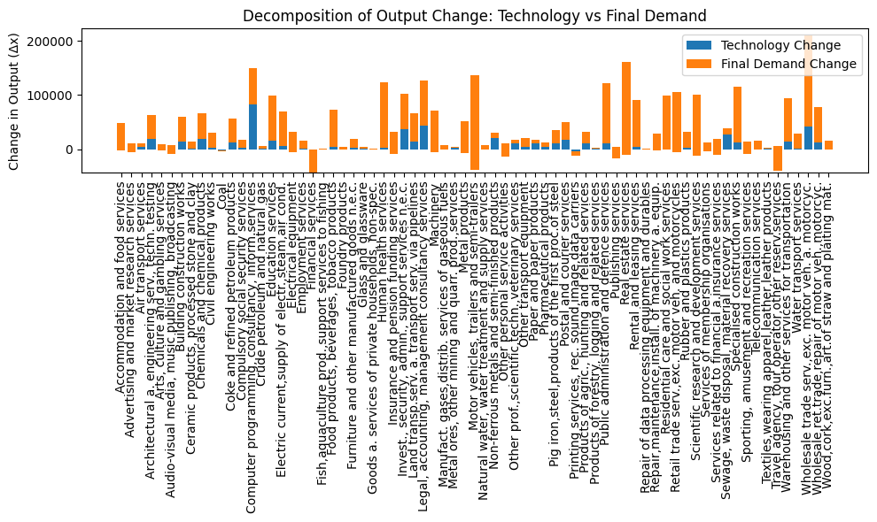

# Extracting Time Series of Germany’s Input–Output Tables

This project provides a lightweight Python script to download, unzip and combine multiple revisions of Germany’s national **Input–Output Tables** from the official **GENESIS Online** database of the German Federal Statistical Office (Destatis).

## Data Source

- **Website:** GENESIS Online (Destatis)  
- **API Endpoint:** `https://www-genesis.destatis.de/genesisWS/rest/2020/data/tablefile`  
- **Access Token:** A personal API token (set in `API_TOKEN`) is required to authenticate requests.

The script retrieves five different table revisions (codes `81511-0001` through `81511-0005`), each provided in a compressed CSV format. After downloading and unzipping, the tables are read into Pandas DataFrames, tagged with their source code, and concatenated into a single DataFrame for time‑series analysis.

## Features

- **Automated download** of multiple table versions via HTTP POST  
- **Unzipping** and parsing of semicolon‑delimited, European‑style decimal CSVs  
- **NaN handling** for common markers (`"..."`, `"-"`, `"/"`, `"x"`)  
- **Source tracking** by adding a `source_table` column  
- **Easy extension**: just add new table codes to the `TABLE_CODES` list  

## Usage

1. Clone the repository:
   ```bash
   git clone https://github.com/your-username/extracting-time-series-germany-io-tables.git
   cd extracting-time-series-germany-io-tables
````

2. Install dependencies:

   ```bash
   pip install pandas requests
   ```
3. Edit `download_io_tables.py` and set your `API_TOKEN` (replace the placeholder).
4. Run the script:

   ```bash
   python download_io_tables.py
   ```
5. The combined DataFrame `df_all` will contain all time‑series rows and a `source_table` column.

## License

This repository is released under the MIT License.

```
---

## Analysis Results

🔎 **My Analysis of Germany’s Input–Output Tables (Input‑Output‑Tabellen)** reveals where **Technology Changes (Technologieänderungen)** have been strongest and weakest across sectors.

📊 Below is a stacked bar chart showing the decomposition of output change into:

- **Technology Change (Technologieänderung)**
- **Final Demand Change (Veränderung der Endnachfrage)**

**Top sectors with the highest technology-driven growth (höchste technologiegetriebene Zuwächse):**

1. **Manufacture of Machinery & Equipment (Maschinen‑ und Anlagenbau)**
2. **Basic Metals & Fabricated Metal Products (Grundmetallerzeugung & Metallverarbeitung)**
3. **Chemical Products (Chemieindustrie)**

**Sectors with the lowest technology impact (geringste Technologieauswirkung):**  
- **Agriculture, Forestry & Fishing (Landwirtschaft, Forstwirtschaft & Fischerei)**  
- **Construction (Bau)**  
- **Food & Beverages (Lebensmittel & Getränke)**  

This structural decomposition analysis (Strukturelle Zerlegungsanalyse) highlights where innovation is driving Germany’s industrial evolution—and where final‑demand shifts still dominate.



*Figure: Decomposition of output change into technology-driven vs. demand-driven components*  

