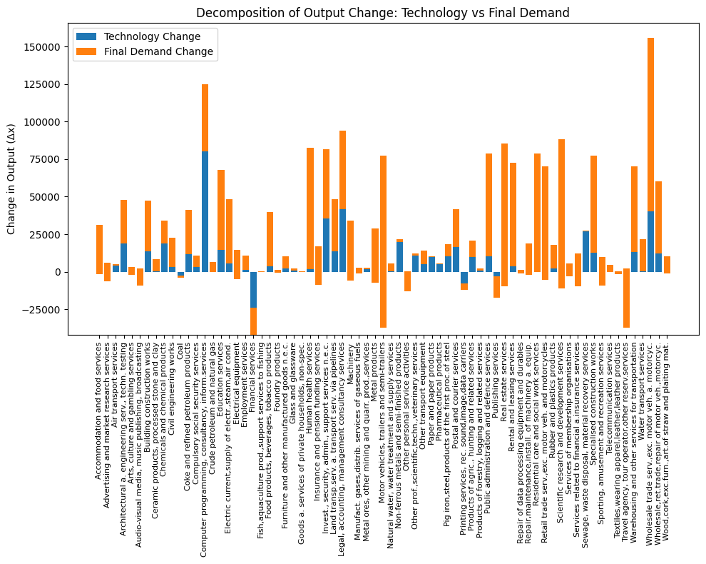

# Extracting & Decomposing Germany’s Input–Output Tables: Technology vs Final Demand

## Structural Decomposition

The Structural Decomposition (SD) method was developed over time, starting with Carter (1970), and extended by Blair and Wyckoff (1989), Skolka (1989), Rose and Casler (1996), and Miller and Blair (2009).
This method allows us to decompose changes in input-output relationships between two time points — for example, $t = 2010$ and $t = 2022$ — into contributions from different sources of change.

The central equation of the input-output model is:

$$
\mathbf{x} = (\mathbf{I} - \mathbf{A})^{-1} \mathbf{y}
$$

For two time periods:

$$
\mathbf{x}^t = (\mathbf{I} - \mathbf{A}^t)^{-1} \mathbf{y}^t = \mathbf{B}^t \mathbf{y}^t
$$

Let $t = 0$ be the base year and $t = 1$ the target year:

$$
\mathbf{x}^0 = \mathbf{B}^0 \mathbf{y}^0
$$

$$
\Delta\mathbf{x} = \mathbf{x}^1 - \mathbf{x}^0 = \mathbf{B}^1 \mathbf{y}^1 - \mathbf{B}^0 \mathbf{y}^0
$$

Now define:

$$
\Delta \mathbf{B} = \mathbf{B}^1 - \mathbf{B}^0
$$

$$
\Delta \mathbf{y} = \mathbf{y}^1 - \mathbf{y}^0
$$

### Type I Decomposition

$$
\Delta\mathbf{x} = \mathbf{B}^1 \Delta \mathbf{y} + \Delta \mathbf{B} \mathbf{y}^0
$$

Where:

* $\mathbf{B}^1 \Delta \mathbf{y} = \mathbf{B}^1 \mathbf{y}^1 - \mathbf{B}^1 \mathbf{y}^0$
* $\Delta \mathbf{B} \mathbf{y}^0 = \mathbf{B}^1 \mathbf{y}^0 - \mathbf{B}^0 \mathbf{y}^0$

### Type II Decomposition

Alternatively:

$$
\Delta\mathbf{x} = \Delta \mathbf{B} \mathbf{y}^1 + \mathbf{B}^0 \Delta \mathbf{y}
$$

Where:

* $\Delta \mathbf{B} \mathbf{y}^1 = \mathbf{B}^1 \mathbf{y}^1 - \mathbf{B}^0 \mathbf{y}^1$
* $\mathbf{B}^0 \Delta \mathbf{y} = \mathbf{B}^0 \mathbf{y}^1 - \mathbf{B}^0 \mathbf{y}^0$

### Type III Decomposition

Using year 0 values as weights:

$$\Delta\mathbf{x}= \mathbf{B}^0\,\Delta \mathbf{y}+ \Delta \mathbf{B}\,\mathbf{y}^0+ \Delta \mathbf{B}\,\Delta \mathbf{y}$$

### Type IV Decomposition

Using year 1 values as weights:

$$
\Delta\mathbf{x}= \Delta \mathbf{B}\,\mathbf{y}^1 + \mathbf{B}^1\,\Delta \mathbf{y} - \Delta \mathbf{B}\,\Delta \mathbf{y}
$$

### Averaged (Combined) Decomposition

As proposed by Dietzenbacher and Los (1998), a symmetric decomposition averages Types I and II:

$$\Delta\mathbf{x}= \frac{1}{2} \Delta \mathbf{B} (\mathbf{y}^0 + \mathbf{y}^1)+ \frac{1}{2} (\mathbf{B}^0 + \mathbf{B}^1) \Delta \mathbf{y}$$

This decomposition separates the total change in output into two parts:

* One part due to technological change (based on $\Delta \mathbf{B}$)
* Another part due to changes in final demand (based on $\Delta \mathbf{y}$)

---

This project provides a lightweight Python script to download, unzip and combine multiple revisions of Germany’s national **Input–Output Tables** from the official **GENESIS Online** database of the German Federal Statistical Office (Destatis).

## Data Source

- **Website:** GENESIS Online (Destatis)  
- **API Endpoint:** `https://www-genesis.destatis.de/genesisWS/rest/2020/data/tablefile`  
- **Access Token:** A personal API token (set in `API_TOKEN`) is required to authenticate requests.

The script retrieves five different table revisions (codes `81511-0001` through `81511-0005`), each provided in a compressed CSV format. After downloading and unzipping, the tables are read into Pandas DataFrames, tagged with their source code, and concatenated into a single DataFrame for time‑series analysis.

## Features

- **Automated download** of multiple table versions via HTTP POST  
- **Unzipping** and parsing of semicolon‑delimited, European‑style decimal CSVs  
- **NaN handling** for common markers (`"..."`, `"-"`, `"/"`, `"x"`)  
- **Source tracking** by adding a `source_table` column  
- **Easy extension**: just add new table codes to the `TABLE_CODES` list  

## License

This repository is released under the MIT License.

## Analysis Results

🔎 **My Analysis of Germany’s Input–Output Tables (Input‑Output‑Tabellen)** reveals where **Technology Changes (Technologieänderungen)** have been strongest and weakest across sectors.

📊 Below is a stacked bar chart showing the decomposition of output change into:

- **Technology Change (Technologieänderung)**
- **Final Demand Change (Veränderung der Endnachfrage)**

**Top sectors with the highest technology-driven growth (höchste technologiegetriebene Zuwächse):**

1. **Manufacture of Machinery & Equipment (Maschinen‑ und Anlagenbau)**
2. **Basic Metals & Fabricated Metal Products (Grundmetallerzeugung & Metallverarbeitung)**
3. **Chemical Products (Chemieindustrie)**

**Sectors with the lowest technology impact (geringste Technologieauswirkung):**  
- **Agriculture, Forestry & Fishing (Landwirtschaft, Forstwirtschaft & Fischerei)**  
- **Construction (Bau)**  
- **Food & Beverages (Lebensmittel & Getränke)**  

This structural decomposition analysis (Strukturelle Zerlegungsanalyse) highlights where innovation is driving Germany’s industrial evolution—and where final‑demand shifts still dominate.

*Figure: Decomposition of output change into technology-driven and demand-driven components from 2010 to 2022*  

## 📊 Technology Change Across Economic Sectors

The table below presents the **Top 10 sectors with the highest positive Technology Change** and the **Bottom 10 sectors with the lowest (or negative) Technology Change**.

### 🔝 Top 10 Sectors by Technology Change

| Sector | Technology Change |
|--------|-------------------|
| Computer programming, consultancy, and information services | 80,278.59 |
| Legal, accounting, and management consultancy services | 41,894.32 |
| Wholesale trade services (excluding motor vehicles and motorcycles) | 40,126.23 |
| Investment, security, administrative and support services (n.e.c.) | 35,299.11 |
| Sewage, waste disposal, and material recovery services | 26,739.35 |
| Non-ferrous metals and semi-finished products | 19,831.86 |
| Architectural and engineering services, technical testing | 18,893.84 |
| Chemicals and chemical products | 18,681.81 |
| Postal and courier services | 16,562.66 |
| Education services | 14,551.63 |

### 🔻 Bottom 10 Sectors by Technology Change

| Sector | Technology Change |
|--------|-------------------|
| Audio-visual media, music publishing, broadcasting | -9,084.59 |
| Services related to financial and insurance services | -9,478.46 |
| Real estate services | -9,910.82 |
| Scientific research and development services | -10,984.42 |
| Printing services, recorded sound, image, data carriers | -12,326.20 |
| Other personal service activities | -12,919.35 |
| Publishing services | -17,206.54 |
| Travel agency, tour operator, and other reservation services | -37,211.31 |
| Motor vehicles, trailers, and semi-trailers | -37,233.93 |
| Financial services | -41,962.22 |

> ℹ️ These values reflect the net change in technology adoption or impact across sectors, potentially influenced by digitization, automation, and innovation intensity.

### 📁 `IO_TS_DE.py`

This script **only collects time series data from input-output tables**.  
The **Python code for calculating technology changes** will be shared here **soon**.

